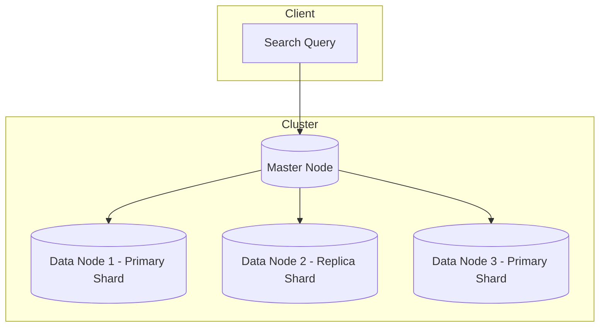

# Elasticsearch 

## 1. What is Elasticsearch?
- Open-source, distributed, REST-based search and analytics engine.
- Built on top of **Apache Lucene**.
- Optimized for **full-text search**, log analysis, analytics dashboards, and distributed querying.

Relational DBs (Postgres, MySQL) struggle with:
- Text search
- Ranking by relevance
- Autocomplete
- Large-scale distributed search

Elasticsearch solves this via:
- **Inverted indexes** for text
- **Sharding + replication** for scaling and fault tolerance
- **Near real-time search** (NRT)

---

## 2. ELK Stack
- **Elasticsearch** → core engine
- **Logstash** → ingestion pipeline (data processing)
- **Kibana** → visualization & dashboards
- *(Optional: Beats)* → lightweight shippers for logs/metrics

---

## 3. Data Model
- **Index** → like a Database  
- **Document** → like a Row (stored as JSON)  
- **Field** → like a Column (JSON key-value pair)  
- **Type** → deprecated (was like a Table)  

### Example
```json
{
  "user": "ahmed",
  "age": 25,
  "bio": "Software engineer and guitarist"
}
````

---

## 4. Inverted Index

The key idea behind Elasticsearch.
Instead of storing docs sequentially, ES builds a **map of terms → docs**.

### Example

```
Term     → Document IDs
------------------------
"dog"    → [1, 4, 7]
"cat"    → [2, 5]
"house"  → [3, 4]
```

This makes search fast.

---

## 5. Text Analysis Pipeline

Before text is indexed, it goes through an **analyzer**:

1. **Tokenizer** → splits text into terms
2. **Filters** → lowercase, stemming, stop-word removal, synonyms
3. Terms are stored in the **inverted index**

Example:
`"Running with Dogs"` → `["run", "dog"]`

---

## 6. Ranking & Relevance

### TF/IDF

* **TF (Term Frequency):** higher term count → more important.
* **IDF (Inverse Document Frequency):** rare terms are more important.

### BM25 (Default in ES)

* Improvement over TF/IDF.
* Adds document length normalization and better handling of frequent words.

---

## 7. Query Types

* **Full-text queries**:

  * `match`, `match_phrase`, `multi_match`
* **Structured queries**:

  * `term`, `range`, `bool`, `exists`
* **Aggregations**:

  * For analytics (like SQL GROUP BY + aggregations)

### Filter vs Query

* **Filter:** fast, cached, no scoring (e.g., `age > 25`)
* **Query:** scored by relevance (BM25, TF/IDF)

---

## 8. Architecture

* **Node** → single server instance of Elasticsearch

  * **Master Node:** manages cluster state, metadata
  * **Data Node:** stores data and serves queries
  * **Ingest Node:** pre-process docs
  * **Coordinating Node:** routes queries
* **Cluster** → collection of nodes
* **Shard** → partition of an index
* **Replica** → copy of a shard

### Diagram

```
Index "users"
 ├── Primary Shard 1 → Data
 │    └── Replica Shard (on another node)
 ├── Primary Shard 2 → Data
 │    └── Replica Shard (on another node)
```

---

## 9. Shards & Replicas

* **Primary Shard**: where data is written first
* **Replica Shard**: copy for fault tolerance + parallel queries
* Shards allow **scaling horizontally**
* Replicas allow **high availability**

---

## 10. Indexing Workflow

1. Client sends document → Elasticsearch
2. Routed to correct **primary shard**
3. Document goes through **analyzer** → inverted index
4. Replicated to **replica shards**
5. Searchable in near real-time (\~1 second)

---

## 11. Cluster Coordination

* **Leader election** if master node fails
* Uses **consensus protocol** (similar to Raft)
* Ensures cluster is consistent

---

## 12. Scaling

* **Horizontal scaling:** add more nodes
* **Distributed queries:** query is broken into shard-level queries, then results merged
* **Partitioning:** documents assigned to shards via a hash function

---

## 13. Use Cases

* Autocomplete & suggestions
* E-commerce product search
* Log/metrics monitoring (ELK stack)
* Analytics dashboards
* Geo-spatial queries

---

## 14. Limitations

* **Not a relational DB** → weak joins, transactions
* **Eventual consistency** → writes may take \~1s to be visible
* **Cluster management** can get complex at scale
* **Heavy memory usage** (inverted index stored in RAM for speed)

---

## 15. Diagram (Mermaid)



---

#  Key Takeaways

* Elasticsearch = **Inverted index + Distributed cluster + BM25 ranking**.
* Core: **Indexes, Shards, Replicas**.
* Querying supports **full-text search + analytics**.
* ES scales horizontally and powers **log search, product search, and analytics**.
* Use ES when you need **fast search & relevance**, not relational consistency.

